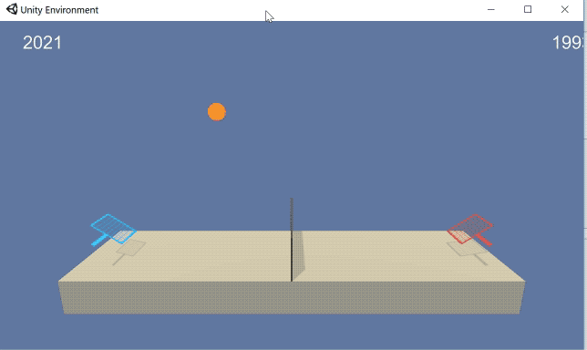

## Project Details

In this project we will attempt to train an two agents to cooperatively play a game of tennis. Each agent receives a reward of +0.1 if it hits the ball over the net. It receives a reward of -0.01 if the ball touches the ground, or if it goes out of bounds. 

This environment is implemented in Unity.

##### Rewards
Each agent receives a reward of +0.1 if it hits the ball over the net. It receives a reward of -0.01 if the ball touches the ground, or if it goes out of bounds. 

##### State
The state space consists of 24 dimensions representing the positions and velocities of the ball and rackets.

##### Actions
The action is a continuous space consisting of two variables. The variables control the racket moving towards and away from the net, and moving up and down. The values of each variable should be in the range -1 to 1

##### Solving the environment
The environment is considered solved by 
a) For each round calculate the max score received by either agent.
b) Calculate the average max score over the last 100 episodes

If the average max score over 100 consecutive episodes exceeds 0.5, the environment is considered solved.

## Getting Started

##### Dependencies
If you have already set up an environment for Udacity's Deep Reinforcement Learning programme, then you should have all needed dependencies installed. If not head over to 

https://github.com/udacity/deep-reinforcement-learning#dependencies

and follow the instructions there

##### Project files
Once you've set up the environment, download all the files from this repository into a single folder, and you should be good to go

## Instructions

Navigate to the folder where you've downloaded the project files and run the command

`jupyter notebook Tennis.ipynb`

Follow the instructions in the notebook. If you do run into some errors regarding the Unity environment, try restarting the kernel.

To jump straight to training the agent first run the code in sections 1,2,3, and then jump to section 4. Section 5 lets you view the performance of an trained agents.