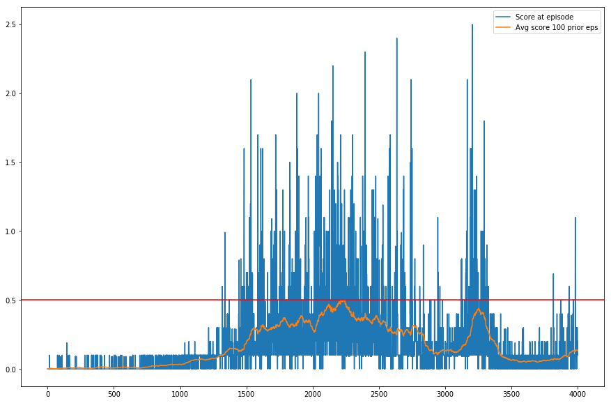

# MADDPG Network to solve a cooperative Tennis environment

## Learning Algorithm

The algorithm used to create the agent is Multi Agent Deep Deterministic Policy Gradients ([Original MADDPG Paper](https://arxiv.org/pdf/1706.02275.pdf))

MADDPG extends DDPG to work in multi agent situations. In DDPG, an agent has two networks - an actor and a critic. The actor takes the state of the world and returns an action. The critic helps the actor decide what actions to reinforce during training. In MADDPG, we create a DDPG network for each agent. The 'actor' part of each agent remains the same, that is, it is only able to receive its observations, and provide an action to take. The critic however is given information not only of the agents state, but also the observations and actions of the other agents. It should be noted that this information is only used during training. During testing, the agents actions are solely driven by the actor which only receives its own observations.

Since the two agents in this problem are equivalent, the experiences from both agents are stored in a shared replay buffer. During training, experiences are randomly sampled from this buffer. That way each agent is able to learn from the experiences of the other agent.

The implementation used the Udacity DDPG solution as the baseline. 

### Parameters
The neural network used is a simple two-hidden layer network with ReLU activation. 

#### Actor network
This is a simple two-hidden layer network.

Here is the description of the network

* Hidden Layer 1 - 64 units, ReLU activation, Batch Normalization
* Hidden Layer 2 - 64 units, ReLU activation, Batch Normalization
* Output Layer - 2 units, tanh activation

The tanh function is used so that the output actions are in the range -1 to 1. 

#### Critic network

This is another simple two-hidden layer network
* Hidden Layer 1 - 64 units, ReLU activation, Batch Normalization
* Hidden Layer 2 - 64 units, ReLU activation,  Batch Normalization
* Output Layer - 1 units, Linear activation

The output just has one unit since we're using it to estimate the value given the states and actions of all agents

#### Other Parameters

The other parameters involved were
* The Adam optimizer was used for both the actor and critic with the learning rate set to 1e-3.
* Gamma (Discount Factor) which was set to 0.99 which is a good default value to use
* Tau (Soft update factor) was also set to 1e-3 for both actor and critic networks. This allows the network paprameters to slowly approach the target parameter values.
* Training epochs (50) - This is how many gradient optimizaiton steps we perform with a set of sampled experiences from the replay buffer. Using more epochs results in more stable updates but at the cost of lower performance. 5 seemed to be a good number since we saw consistent improvement as the training went on
* Minibatch size - 1024
* L2 Weight Decay factor was set to 1e-5
* Replay Buffer size - 2e6

## Plot of Rewards

The following plots shows the rewards at each episode, as well as the average over the last 100 episodes. The overall average of the max score over 100 episodes crossed 0.5 after training for 2213 episodes. A red reference line marking a reward of 0.5 is shown as well.

## Ideas for Future Work

### Create a multi-agent PPO network
Initially an attempt to use a multi-agent version of PPO was made. The idea was similar to what we do for MADDPG, that is, there would be two agents each with their own actor and critic. The critic would receive additional information about the state and actions of the other agents. Despite several attempts and modifications it did not seem to improve beyond an average max score of 0.15. It would be a good to explore further, because PPO tends to be more stable and perhaps would not degrade as MADDPG does after several iterations.

### Experiment with architectures and parameters
The architecture used in this implementation is a simple two-hidden layer network (both for the actor and critic). Experimenting with different architectures (such as shared weights between the actor and critic) and activation functions could possibly yield a further improvement in the agents performance. Furthermore it would also help to explore the effect of other parameters and see what effect they have.